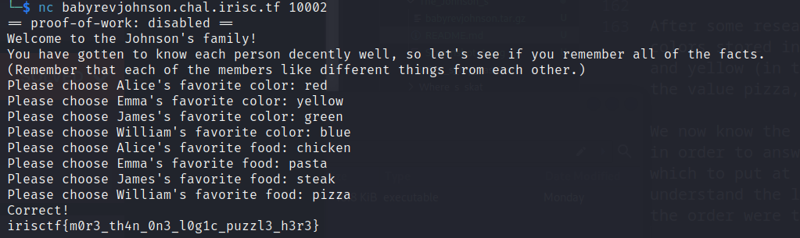

# The Johnson's

## Problem statement

Please socialize with the Johnson's and get off your phone. You might be quizzed on it!

```nc babyrevjohnson.chal.irisc.tf 10002```

The archive to find the executable : ```babyrevjohnson.tar.gz```

## Solution

To find the flag, you need to answer correctly to all of the questions concerning the Johnson's family. You'll have to answer questions concerning the favorite color and the favorite food for each member of the family. Be aware that each member like different things from each other.

To find the solution, you have to disassemble the executable. In this challenge we've used the Ghidra software in order to this task.

There is two functions that you need to look in order to understand the logic of the program.

First is the ```main``` function :

```
undefined8 main(void)

{
  int iVar1;
  long in_FS_OFFSET;
  int local_84;
  int local_80;
  int local_7c;
  char local_78 [104];
  long local_10;
  
  local_10 = *(long *)(in_FS_OFFSET + 0x28);
  puts("Welcome to the Johnson\'s family!");
  puts(
      "You have gotten to know each person decently well, so let\'s see if you remember all of the f acts."
      );
  puts("(Remember that each of the members like different things from each other.)");
  local_84 = 0;
  while (local_84 < 4) {
    printf("Please choose %s\'s favorite color: ",*(undefined8 *)(names + (long)local_84 * 8));
    __isoc99_scanf(&DAT_0010217c,local_78);
    iVar1 = strcmp(local_78,colors);
    if (iVar1 == 0) {
      local_80 = 1;
LAB_00101449:
      if ((((local_80 == chosenColors) || (local_80 == DAT_00104094)) || (local_80 == DAT_00104098))
         || (local_80 == DAT_0010409c)) {
        puts("That option was already chosen!");
      }
      else {
        (&chosenColors)[local_84] = local_80;
        local_84 = local_84 + 1;
      }
    }
    else {
      iVar1 = strcmp(local_78,PTR_DAT_00104048);
      if (iVar1 == 0) {
        local_80 = 2;
        goto LAB_00101449;
      }
      iVar1 = strcmp(local_78,PTR_s_green_00104050);
      if (iVar1 == 0) {
        local_80 = 3;
        goto LAB_00101449;
      }
      iVar1 = strcmp(local_78,PTR_s_yellow_00104058);
      if (iVar1 == 0) {
        local_80 = 4;
        goto LAB_00101449;
      }
      puts("Invalid color!");
    }
  }
  local_84 = 0;
  do {
    while( true ) {
      if (3 < local_84) {
        check();
        if (local_10 != *(long *)(in_FS_OFFSET + 0x28)) {
                    /* WARNING: Subroutine does not return */
          __stack_chk_fail();
        }
        return 0;
      }
      printf("Please choose %s\'s favorite food: ",*(undefined8 *)(names + (long)local_84 * 8));
      __isoc99_scanf(&DAT_0010217c,local_78);
      iVar1 = strcmp(local_78,foods);
      if (iVar1 != 0) break;
      local_7c = 1;
LAB_0010159c:
      if (((local_7c == chosenFoods) || (local_7c == DAT_001040a4)) ||
         ((local_7c == DAT_001040a8 || (local_7c == DAT_001040ac)))) {
        puts("That option was already chosen!");
      }
      else {
        (&chosenFoods)[local_84] = local_7c;
        local_84 = local_84 + 1;
      }
    }
    iVar1 = strcmp(local_78,PTR_s_pasta_00104068);
    if (iVar1 == 0) {
      local_7c = 2;
      goto LAB_0010159c;
    }
    iVar1 = strcmp(local_78,PTR_s_steak_00104070);
    if (iVar1 == 0) {
      local_7c = 3;
      goto LAB_0010159c;
    }
    iVar1 = strcmp(local_78,PTR_s_chicken_00104078);
    if (iVar1 == 0) {
      local_7c = 4;
      goto LAB_0010159c;
    }
    puts("Invalid food!");
  } while( true );
}
```

Second the ```check``` function:

```
void check(void)

{
  byte bVar1;
  bool bVar2;
  
  if ((DAT_001040a8 == 2) || (DAT_001040ac == 2)) {
    bVar2 = false;
  }
  else {
    bVar2 = true;
  }
  if ((chosenColors == 3) || (DAT_00104094 == 3)) {
    bVar1 = 0;
  }
  else {
    bVar1 = 1;
  }
  if (DAT_0010409c == 2 &&
      (DAT_00104098 != 4 &&
      (DAT_001040ac != 3 && (chosenFoods == 4 && (bool)((DAT_00104094 != 1 && bVar2) & bVar1))))) {
    puts("Correct!");
    system("cat flag.txt");
  }
  else {
    puts("Incorrect.");
  }
  return;
}
```

We can easily find that our goal is to satisfy the if condition to trigger the ```cat flag.txt``` command. After some research in the assembly code, we found that there is 4 important arrays to find:
- One array named ```colors``` which stores all the possible colors;
- One array named ```foods``` which stores all the possible food;
- One array named ```chosenColors``` which stores every answer given by the user concerning the favorite color for every member. The array is filled in as the user answers the various questions;
- One array named ```chosenFoods``` which stores every answer given by the user concerning the favorite food for every member. The array is filled in as the user answers the various questions; 

We have to guess the right favorite color and the right food for each member. Before doing that, we have to know what are all the colors and food available in the program.

After some research in the assembly code, we found that the colors stored in the ```colors``` array were red, blue, green and yellow (in that order). For the ```food``` array, we found the value pizza, pasta, steak and chicken (in that order).

We now know the different colors and food that we need to choose in order to answer each of the questions. But we need to know which to put at what question. In order to do that, we have to understand the logic in the check function. After some analysis, the order were the following :


The flag is : **irisctf{m0r3_th4n_0n3_l0g1c_puzzl3_h3r3}**